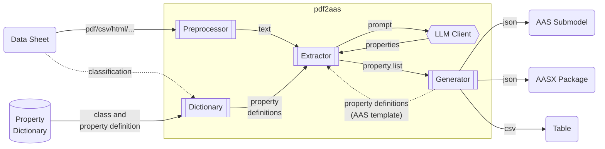
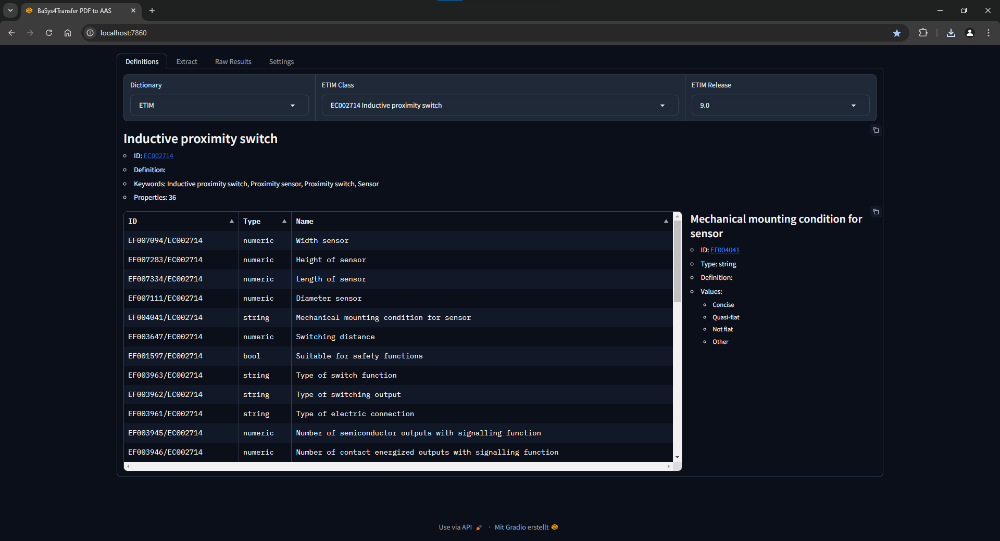
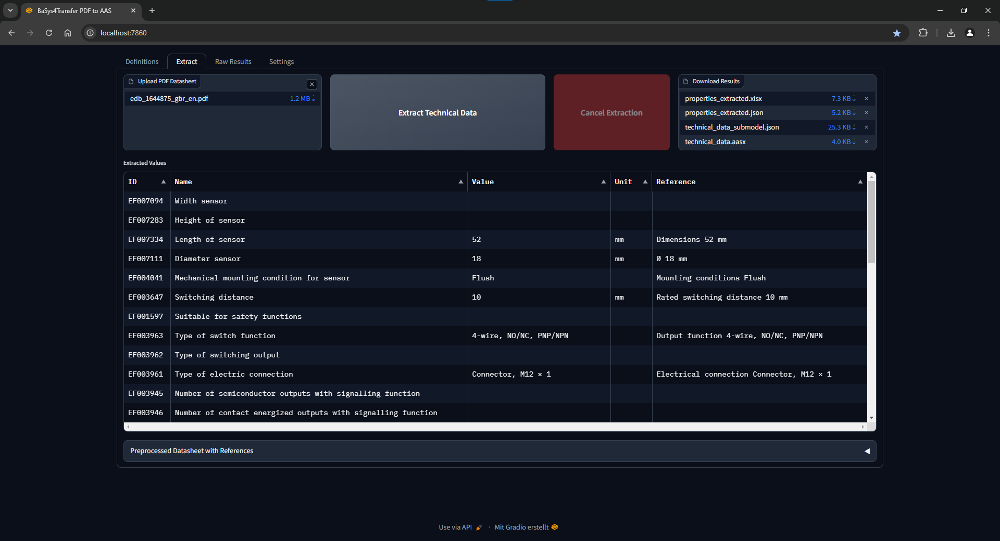

# PDF to AAS

Python library and scripts to extract technical data from PDFs utilizing transformers and especially **Large Language Models (LLMs)** to export them in an **Asset Administration Shell (AAS)** submodel.

## Workflow



Remarks:

* Typical *Property Dictionaries* are ECLASS, CDD, ETIM, EDIBATEC, EPIC, GPC, UniClass.
* The *classification* (e.g. ECLASS or ETIM class of the device) will be done manualy first, but can be automated (e.g. also via LLMs, RAG, etc.) in the future.
* Additional *PDF Preprocessors* might be added in the future, e.g. specialized on table or image extraction.
LLMs might also be used to preprocess the PDF content first, e.g. summarize it in JSON format.
* Property definitions might be derived from an AAS template (or instance), instead of providing the property definitions from a class of a dictionary directly.

## Usage

```py
from pdf2aas import PDF2AAS
pdf2aas = PDF2AAS()
pdf2aas.convert('path/to/datasheet.pdf', 'eclass id e.g. 27274001', 'path/to/submodel.json')
```

The [default toolchain PDF2AAS](src/pdf2aas/core.py) will save the submodel in json format to a given path, using:

* pypdfium2 preprocessor
* ECLASS dictionary
* PropertyLLMSearch extractor with openAI client
* AAS Technical Data Submodel generator

See [Modules](#modules) for details.

## Examples

You can find some example toolchains with intermediate steps in the [examples](examples/) folder.
To run them make sure pdf2aas is installed according to [setup section above](#setup).
Then execute for example: `python default_toolchain.py`
Use `-h` or `--help` argument for more information on command line arguments.

### Webui

A gradio based web UI is available by starting [examples/demo_gradio.py]().
To use it, additional dependencies need to be installed listed in demo-requirements: `pip install -r demo-requirements.txt`
The webserver is also build as an windows executable, which can be download from the job artifacts: [](https://github.com/eclipse-basyx/basyx-pdf-to-aas/actions/workflows/pyinstaller-demo-gradio-win.yml)

The web UI features the selection of an asset class from ECLASS, ETIM or CDD dictionary in different releases.
If no dictionary is selected, the extractor searches for all technical propertiers without using definitions.
An AAS Template (in fact any aasx package) can be opened and searched for properties. They can be used as definitions to search for as well.


A datasheet (PDF, text, csv, html, ...) can be uploaded and the properties of the selected dictionary class or AAS templated can be extracted by an LLM.
The extracted properties can be downloaded as xlsx, json, technical data submodel (json) and as an AAS (aasx).
In case of a given AAS template, the aasx can be downloaded with property values updated from the extraction.
The UI shows a table of the extracted properties and marks their references in the preprocessed text if found.


The Raw Results tabs show the raw and formated prompt and answer from the LLM in Chatbot style and json.
Moreover, the Settings tab allows to configure different extractor and client parameter.

## Modules

* `preprocessor`: converts the PDF to a text format that can be processed by LLMs, keeping layout and table information.
  * `PDFium`: Uses [pypdfium2](https://github.com/pypdfium2-team/pypdfium2) based on PDFium to extract text from pdf without layout information
  * `PDF2HTML`: Uses [pdf2htmlEX](https://github.com/pdf2htmlEX/pdf2htmlEX) to convert the PDF data sheets to HTML.
    The converted html is preprocessed further to reduce token usage for the llms.
  * `PDFPlumber`: Uses [pdfplumber](https://github.com/jsvine/pdfplumber) to extract text from the pdf, based on [pdfminer.six](https://github.com/pdfminer/pdfminer.six).
  * `PDFPlumberTable`: Uses [pdfplumber](https://github.com/jsvine/pdfplumber) to extract *tables* from the pdf. Can output the extractrated tables in various formats using *tabula*, e.g. markdown.
  * `Text`: Opens the file as text file, allowing to use text file formats like txt, html, csv, json, etc.
* `dictionary`: defines classes and properties semantically.
  * `ECLASS`: loads property definitions from [ECLASS website](https://eclass.eu/en/eclass-standard/search-content) for a given ECLASS class.
    * To load from an release the CSV version needs to be placed as zip file in `temp/dict` and named similar to `ECLASS-14.0-CSV.zip`.
    * Make sure to comply with [ECLASS license](https://eclass.eu/en/eclass-standard/licenses).
  * `ETIM`: loads property definitions via the [ETIM API](https://etimapi.etim-international.com/)
    * Provide ETIM API client id and secret as environment variables.
    * To load from an [ETIM model release](https://www.etim-international.com/downloads/?_sft_downloadcategory=model-releases&_sft_language=etim-english&_sft_format=csv&_sft_unit=metric) the CSV version needs to be placed as zip file in `temp/dict`.
    * Make sure to comply with [ETIM license](https://www.etim-international.com/classification/license-info/), which refers to the [Open Data Commons Attribution License](https://opendatacommons.org/licenses/by/1.0/).
  * `CDD`: loads property definitions from [IEC CDD website](https://cdd.iec.ch/) for a given CDD class.
    * Make sure to comply with [CDD license](https://cdd.iec.ch/cdd/iec62683/iec62683.nsf/License?openPage). We are only using "FREE ATTRIBUTES" according to the current license.
* `extractor`: extracts technical properties from the preprocessed data sheet.
  * `PropertyLLM`: Prompts an LLM client to extract all properties (without definitions) from a datasheet text.
  * `PropertyLLMSearch`: Prompts an LLM to search for values of given property definitions from a datasheet text.
  * `PropertyLLMMap`: Prompts an LLM client to extract all properties from a datasheet text and maps them with given property definitions (currently only by the label).
  * Clients: The PropertyLLM extractors can be used with `OpenAI`, `AzureOpenAI` and a `CustomLLMClientHTTP` ([defined here](src/pdf2aas/extractor/customLLMClient.py)) at different local or cloud endpoints. 
* `generator`: transforms an extracted property-value list into different formats.
  * `AASSubmodelTechnicalData`: outputs the properties in a [technical data submodel](https://github.com/admin-shell-io/submodel-templates/tree/main/published/Technical_Data/1/2).
  * `AASTemplate`: loads an aasx file as template to search for and update all contained properties. 
  * `CSV`: outputs the extracted properties as csv file
* `model`: python classes to handle properties, their definitions and dictionary classes inside the library.
* `evaluation`: python classes to evaluate the library against existing AASes. Needs [optional dependencies, c.f. Evaluation.](#evaluation)

## Setup

* Virtual Environment (Optional but highly recommended)
  * Create a virtual environment, e.g. with venv in current directory with `python -m venv .venv`
  * Activate it
    * Windows: `.venv/Scripts/activate`
    * Linux: `source .venv/bin/activate`
* Install requirements: `python -m pip install -r requirements.txt`
* Install the pdf2aas package: `python -m pip install .`

### Development

* Install dev requirements: `python -m pip install -r dev-requirements.txt`
  This allows to run the tests and installer, etc.
* Install pdf2aas as editable package with `python -m pip install -e .`
  This makes the package importable in the entire local system while remaining editable.

### Specific Toolchains

* For [pdf2htmlEX (HTML) preprocessor](src/pdf2aas/preprocessor/pdf_pdf2htmlEX.py) the binary needs to be [downloaded](https://github.com/pdf2htmlEX/pdf2htmlEX/wiki/Download) and installed. Currently it is only available for Linux distributions, but it can be used via WSL or Docker on Windows.
* To run a local model, the extractor needs to be initialised or configured with an openai API conform `api_endpoint` or using a `CustomLLMClientHTTP`.
* For some toolchains specific **environment variables** need to be set, e.g. via `.env` file and the `python-dotenv` package.
  * `OPENAI_API_KEY`: to use the extractor via the OpenAI public endpoint.
  * `AZURE_OPENAI_API_KEY`, `AZURE_ENDPOINT`, `AZURE_DEPLOYMENT`, `AZURE_API_VERSION`: To use an AzureOpenAI client.
  * `ETIM_CLIENT_ID` and `ETIM_CLIENT_SECRET`: to use the [ETIM](src/pdf2aas/dictionary/etim.py) dictionary via ETIM API.

## Tests

[](https://github.com/eclipse-basyx/basyx-pdf-to-aas/actions/workflows/test.yml)
[](https://github.com/eclipse-basyx/basyx-pdf-to-aas/actions/workflows/ruff.yml)
[](https://github.com/eclipse-basyx/basyx-pdf-to-aas/actions/workflows/mypy.yml)

* If not already done, install the dev dependencies via `python -m pip install -r dev-requirements.txt`
* Run tests with `pytest`
* To check for codecoverage use `pytest --cov=pdf2aas`
* To check for codestyle use ruff, e.g. `ruff check`
  * You can use `ruff format` etc. to format accordingly.

## Evaluation

The evaluation module allows to evaluate the extraction against existing pairs of an AAS and datasheet.
To use it, additional dependencies need to be installed listed in eval-requirements: `pip install -r eval-requirements.txt`
An [example script](examples/evaluation.py) can be found in the examples folder.

